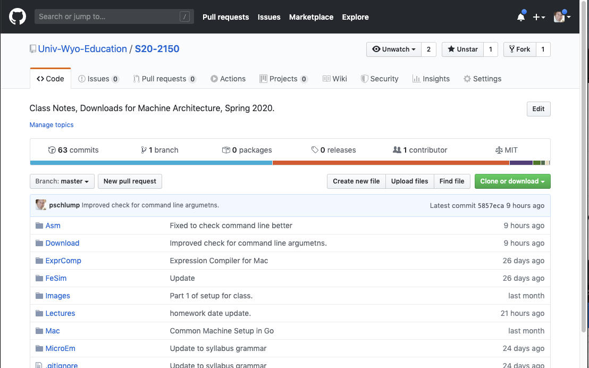
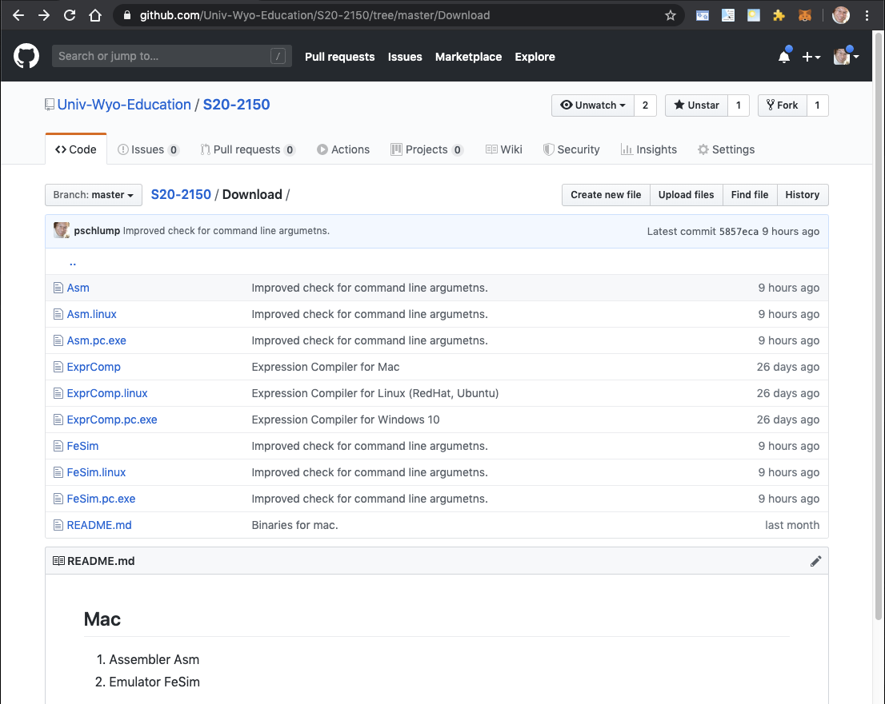
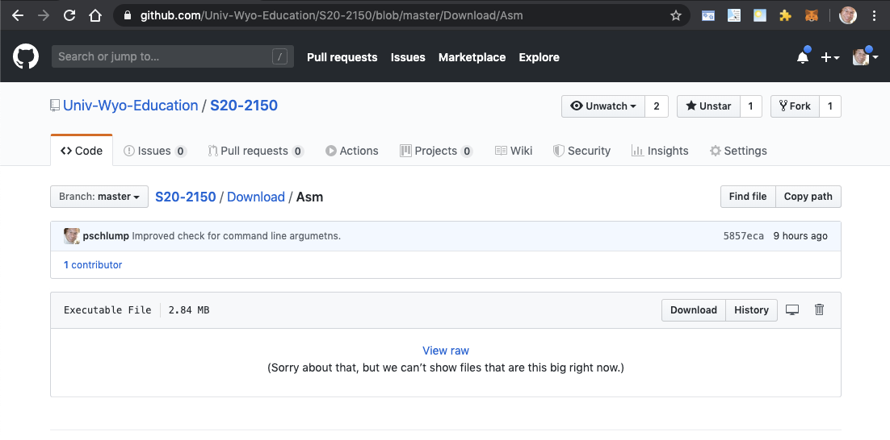

# Run Homework 1

Github - download:

[https://github.com/Univ-Wyo-Education/S20-2150](https://github.com/Univ-Wyo-Education/S20-2150)

<style>
.markdown-body img { 
	border: 4px solid black;
}
</style>



If you have git installed you can clone the entire repository.  You will probably want to do that
before Homework 4.   Right now you need to download 2 programs and be able to run them.

Click on the directory "Download" - In one of my other handouts I put "Downloads" -- my bad.



Click on the "Asm" or "Asm.pc.exe" or "Asm.linux" depending on the OS you are running on.



Click on the "Download" button.

You should have the program at some inconvenient location like your "./Downloads" directory.
Move it to a place that you like and can run it from.

On Windows you will probably have `H:\>`.  On Linux at the bash shell or a Mac in iTerm2 or Terminal
you will have a "$" prompt.   

```
$ Asm.pc.exe --in <FILE.mas> --out <FILE.hex>
```

I fixed the code to have better checking of the command line parameters.  You will need to download
new Asm.pc.exe and FeSim.pc.exe files.

Try 

```
$ Asm.pc.exe --help 
```

And the usage message will get printed.  Same for the other one - it will require some command line
parameters.

```
$ FeSim.pc.exe --in <FILE.hex> --out <output.txt>
```


