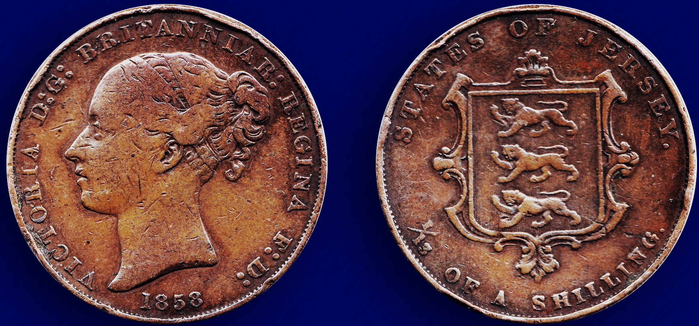

#  Lecture 04 - Base Conversion / Octal / Decimal / Hex / Base37 / Base64 etc.

## How computers represent all information 

Most modern digital computers.  Other representations are possible.

True High.

True Low.

Mixed truth.

Base 3.

Quantum Computer (Q-Bit)

Base10 Number - What we are used to - count on fingers.

Base60 Number - Another system we are used to - count on fingers and nickels - base 12. 

## Base 10 - what is it?

From Wikipedia: 

"The most commonly used system of numerals is the Hindu–Arabic numeral
system. Two Indian mathematicians are credited with developing it. Aryabhata
of Kusumapura developed the place-value notation in the 5th century and a
century later Brahmagupta introduced the symbol for zero. The numeral system and
the zero concept, developed by the Hindus in India, slowly spread to other
surrounding countries due to their commercial and military activities with
India. The Arabs modified it into simple numeral symbols as the Hindi version
was texts rather than symbols. The Arabic numeral system then spread to Europe
along with many other science knowledge and due to merchants trading and using a
stable simple numeral system. The Western world modified them and called them
the Arabic numerals, as they learned them from the Arabs. Hence the current
western numeral system is the modified version of the Hindu numeral system
developed in India. It also exhibits a great similarity to the
Sanskrit–Devanagari notation, which is still used in India and neighbouring
Nepal."

1037 is 1 * 1000 + 0 * 100 + 3 * 10 + 7 or

1 * 10**3 + 0 * 10**2 + 3 * 10**1 + 7 * 10**0

Could we use something other than '10' ? Yep!


## Base 60 / base 12 number systems.

Clocks.

## British system up to 1971

In Feb of 1971 the UK converted to a decimal system.  

The shilling was subdivided into twelve (12) pennies.

One penny is equal to 2 halfpennis.
One penny is 4 farthings ( 1/4 pennies ).

1. 2 farthings = 1 halfpenny
2. 2 halfpence = 1 penny (1d)
3. 3 pence = 1 thruppence (3d)
4. 6 pence = 1 sixpence (a 'tanner') (6d)
5. 12 pence = 1 shilling (a bob) (1s)
6. 2 shillings = 1 florin ( a 'two bob bit') (2s)
7. 2 shillings and 6 pence = 1 half crown (2s 6d)
8. 5 shillings = 1 Crown (5s)
9. 20 shillings = 1 pund (20s)

1/2 moon rising.



## Easy to use computer base - base 8 - Octal.

Digits are 0..7.

C uses a leading '0' to indicate octal.    So... 013 is not equal to 13.  Example.

010 = 0*64 + 1*8 + 3 = 11 base 10.

## Easy to use computer base - base 16 - Octal.

More common is to use base 16.  

Problem we don't have 16 numeric digits, just 0..9.  So we use letters a..f.

C used the designation '0x' or '0X' as a leading marker for base 16.

So 0x13 is not 13.

1 * 16 + 3 = 19 is not the same as base 10 number 13.

13 base 10 is 0xD or 0xd .

Example `od` in base 16.

`od` is part of `CoreUtils`, available via `GnuWin32`.  You can:

```
choco install gnuwin32-coreutils.portable
```


```
$ od -X 1858_States_of_Jersey_1-13_Shilling.jpg >out.out
```

results in

```
0000000          e0ffd8ff        464a1000        01004649        58020101
0000020          00005802        d62de1ff        66697845        4d4d0000
0000040          00002a00        6143a82c        63536f6e        00006e61
0000060          4544694c        30303720        00000046        000060ea
0000100          00006400        000060ea        64416400        2065626f
...
```


```
$ od -X Lect-04.md
```

output

```
0000000          4c202023        75746365        30206572        202d2034
0000020          65736142        6e6f4320        73726576        206e6f69
0000040          634f202f        206c6174        6544202f        616d6963
0000060          202f206c        20786548        6142202f        37336573
...
```


## Base 58

Bitcoin addresses are written in base 58. 

Base58 was developed for Bitcoin.
In base4 58 it takes 35 characters to represent a Bitcoin address.

Eliminate some chars like 'O' and '0' from our set and just use

```
"123456789ABCDEFGHJKLMNPQRSTUVWXYZabcdefghijkmnopqrstuvwxyz"
```

To encode our numbers.  This produces less errors and makes a
clear - human reading for the numbers.

An example library for this: [https://github.com/pschlump/go-base58](https://github.com/pschlump/go-base58).

## Base 64 

Base 2 based, 16 * 4 = 64 - so direct conversion into base 2.

Used in SMTP, Mime-Encoding etc.  It takes 3 bytes (octets) to encode the binary 
data from 2 bytes (octets) of binary data.

[https://en.wikipedia.org/wiki/Base64](https://en.wikipedia.org/wiki/Base64)


## EIP-55

Hex has both lower and upper case A-F, a-f so you can use this 'bit' of information.
For example Ethereum uses this bit in an encoding scheme called EIP-55 to verify that
an address is correct.

```
0x5aAeb6053F3E94C9b9A09f33669435E7Ef1BeAed
```


