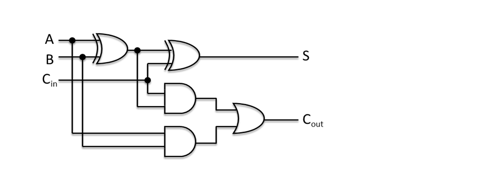
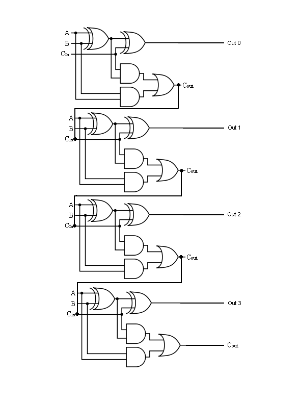

# Lecture 05 - Signed Numbers / Character Codes / Flaot / BCD                                            

Representation of signed numbers ( Chapter 2 )

Logic Table for Addition:

| A  | B  | Ci  | &nbsp;  |  s |  Co |
|:--:|:--:|:---:|:-------:|:--:|:---:|
| 0  | 0  | 0   |         |	0  |  0  |
| 0  | 0  | 1   |         |	1  |  0  |
| 0  | 1  | 0   |         |	1  |  0  |
| 0  | 1  | 1   |         |	0  |  1  |
| 1  | 0  | 0   |         |	1  |  0  |
| 1  | 0  | 1   |         |	0  |  1  |
| 1  | 1  | 0   |         |	0  |  1  |
| 1  | 1  | 1   |         |	1  |  1  |

1 bit addr.

Implementable with some logic gates or a small lookup table.



Or with some small bit of memory to "lookup" the result.
3 addresses in - 2 bits out.

This can then be cascaded into:



## Ones Compliment

Example 2.18 (from the textbook, p75):

```

    23 - 9

    23 + (-9)

    0 0 0 0  1 0 0 1            9
    1 1 1 1  0 1 1 0            -9

    1 1 1      1 1              Carry        -- Carry out used later.
    0 0 0 1  0 1 1 1            23[10]
    1 1 1 1  0 1 1 0            -9
    ----------------- Add
    0 0 0 0  1 1 0 1            Result
                   1            (from cary above)
    0 0 0 0  1 1 1 0            14[10]


```


Disadvantages - Ones Compliment has a negative 0 value.
Take the Ones Compliment of 0

```
0[10] = 0 0 0 0  0 0 0 0
      = 1 1 1 1  1 1 1 1
```

In the land of IoT lots of Digital to Analog converters still use ones compliment.

RFC 791 p.14 defines the IP header checksum as:

"The checksum field is the 16 bit one's complement of the one's complement sum of all 16 bit words in the header. For
purposes of computing the checksum, the value of the checksum field is zero."

A bunch of the Intel 64 and IA-32 instructions (SSE, SSE2, SS3 etc) have data "in 1's compliment form".


## 2's Compliment

AMD's x86-64 architecture (known as AMD64, x86_64) extension to Intel's IA-32 brought 64 bit companion to 
the x86 world.  Mac / Linux today run on this.  Windows sort of runs on this - but - still has a throwback
to 32 bit that is slow and incompatible.   The x86-64 is 2's compliment based.   The only 1's complement
based are the special Intel extensions.

2's compliment solves the 2 zero problem by adding one.

23[10] is the same as before, now to represent -23 we compliment and add 1.

```
    0 0 0 1  0 1 1 1            23[10]
	1 1 1 0  1 0 0 0			compliment(23[10])
	1 1 1 0  1 0 0 1 			Add 1 (-23[10])
```

Let's do the same for -13

```
	0 0 0 0  1 1 0 1 			13[10]
	1 1 1 1  0 0 1 0 			compliment
	1 1 1 1  0 0 1 1 			Add 1 - with carray (-13[10])
```

Now add the 2 notative numbers:

```
	1 1          1 						Carry out 1
	1 1 1 0  1 0 0 1 			-23[10]
	1 1 1 1  0 0 1 1 			-13[10]
	------------------ Add
    1 1 0 1  1 1 0 0


	1 1 0 1  1 1 0 0			Take compliment
	0 0 1 0  0 0 1 1            23 hex
	               1            Add one
	0 0 1 0  0 1 0 0            Hex 0x24  = 36 decimal, add back the Minus
								giving us -36 or a crrect answer.

```


## ZigZag Encoding 

Google claims that it is faster to do this than other forms of encoding - and uses it in Protocol Buffers.

With ZigZag you map signed integers to a set of unsigned values(numbers) - alternating between positive and negative
numbers.  Assume that 0 is a positive number.   Then zig-zag back and forth between 0, positive, -1, negative etc.

| Value | Encoded as |
|:-----:|:----------:|
| 0     | 0          |
| -1    | 1          |
| 1     | 2          |
| -2    | 3          |
| 2147483647 |    4294967294 |
| -2147483648     | 4294967295 |

The computation to get from a number `n` to it's zig-zag form is (for 32 bit number):

```
(n << 1) ^ (n >> 31)
```

Note that `>>` is an arithmetic shift left to negative numbers end up being all 1s.

The `^` is an exclusive OR operation, and `<<` is a shift left with a 0 inserted (multiply by 2).


## Python and Integers

```
$ python
Python 3.7.3 (default, Mar 27 2019, 16:54:48)
[Clang 4.0.1 (tags/RELEASE_401/final)] :: Anaconda, Inc. on darwin
Type "help", "copyright", "credits" or "license" for more information.
>>> 123 * 34343434343434334 * 44
185866666666666615608
>>> 40000000000000000000000000000000000000000000 * 555555555555555555555555555555555
22222222222222222222222222222222200000000000000000000000000000000000000000000
>>>
```

This is super super useful when you are trying to work on encryption stuff and your
numbers are large!  For example: 0x6bbfb5cab3aed19070b7927fccfc62a56452fdc2a1325f70df23ea8c51794382

```
$ python
Python 3.7.3 (default, Mar 27 2019, 16:54:48)
[Clang 4.0.1 (tags/RELEASE_401/final)] :: Anaconda, Inc. on darwin
Type "help", "copyright", "credits" or "license" for more information.
>>> a = 0x6bbfb5cab3aed19070b7927fccfc62a56452fdc2a1325f70df23ea8c51794382
>>> b = 0x545716da
>>> c = a/b
>>> int(c)
34442697389721661380111398828873466051270503593884806570628182179840
>>> print(hex(int(c)))
0x1470d8f34ea3300000000000000000000000000000000000000000000
```

Big numbers I mean:

```
>>> N = 0xc037c37588b4329887e61c2da3324b1ba4b81a63f9748fed2d8a410c2fc21b1232f0d3
bfa024276cfd88448197aae486a63bfca7b8bf7754dfb327c7201f6fd17fd7fd74158bd31ce772c9
f5f8ab584548a99a759b5a2c0532162b7b6218e8f142bce2c30d7784689a483e095e701618437913
a8c39c3dd0d4ca3c500b885fe3
```

## Floats

### IEEE-754 - 32 bit representation

1 Bit sign

8 bits exponent

23 significand

Error Prone: Comparision is never exact.

```
if ( 1 != 1.0 ) {
	printf ( "True\n" )
}
if ( ( 1.0 / 10 ) != 0.1  ) {
	printf ( "True\n" )
}
```

The Correct way to compare floats is:

```
if ( abs(a-b) < epslon ) {
	printf ( "True\n" )
}
```

### Other floating formats

Oracle - Number(Size,Decimals) - Stored as a big float.   All float calculations are done in
software.

### Packed Decimal

Gain accuracy - Loose in storage.    Examples are the most common databases in existence,
PosgreSQL, DB/2 Universal.  Most banks also still use COBOL.

Store each digit in a byte - Example.

Store each digit in 4-bits - wasting 0xA .. 0xF or 40%.


# Copyright

Copyright (C) University of Wyoming, 2019-2020.
