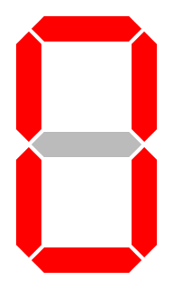

# Homework 3 - Boolean Algebra - Gates / Error Correction   

Remember that I have a grader and if you do not put your name on the top of
your homework - you will *NOT* get credit.  That is bad after doing the work!

Points: 200 

Testing you are expected to produce a unit test for each of the following.   The test should print out "PASS" if it is successful
and run at least 4 examples of good and bad values for each.

1. 50pts - Implement a Lhun Verifier.  Do it in C or C++.
2. 50pts - Implement a Verhoeff verifier in C or C++ (Go steal the code in C - see link - and give credit, note the license - you want an original that is MIT or 3 clause BSD then copy like crazy).
This is the JavaScript(node.js) and Go version that I have on github.com.    Search google for "verhoeff algorithm".
[https://github.com/pschlump/verhoeff_algorithm](https://github.com/pschlump/verhoeff_algorithm)

Java script:  [https://github.com/yuyudhan/verhoeff.git](https://github.com/yuyudhan/verhoeff.git)  Do not copy this - it is proprietary code -  No LICENSE file at all.

Other solutions: License CC Attribution: [https://en.wikibooks.org/wiki/Algorithm_Implementation/Checksums/Verhoeff_Algorithm](https://en.wikibooks.org/wiki/Algorithm_Implementation/Checksums/Verhoeff_Algorithm)

3. 25pts - Provide the circuit diagram in mixed logic for

	Dec1 = ( A & !B & !C & !D ) & !X & Y		

	Dec2 = ( A & !B & !C & !D ) & X & !Y

	Dec3 = ( A & !B & !C & !D ) & X & Y

	(A&!B&!C&!D) is a commmon sub-expression in the hardware.
	
4. 25pts - Derive the truth table for:

5. 50pts - Given the following truth table show the circuit for:
( 74ls47 7-segment LED decoder  - see [https://buzztech.in/bcd-to-seven-segment-decoder-program-in-vhdl/](https://buzztech.in/bcd-to-seven-segment-decoder-program-in-vhdl/) )

I, J, K, L are inputs

a, b, c, d, e, f, g are outputs

| Decimal Digit    | Hex | I | J | K | L | &nbsp; |   a | b | c | d | e | f | g | Display Pattern                                      |
|-----------------:|----:|:-:|:-:|:-:|:-:|--------|:---:|:-:|:-:|:-:|:-:|:-:|:-:|:----------------------------------------------------:|
| 0                | 0x0 | 0 | 0 | 0 | 0 |        |   1 | 1 | 1 | 1 | 1 | 1 | 0 |                 |
| 1                | 0x1 | 0 | 0 | 0 | 1 |        |   0 | 1 | 1 | 0 | 0 | 0 | 0 |                 |
| 2                | 0x2 | 0 | 0 | 1 | 0 |        |   1 | 1 | 0 | 1 | 1 | 0 | 1 |                 |
| 3                | 0x3 | 0 | 0 | 1 | 1 |        |   1 | 1 | 1 | 1 | 0 | 0 | 1 |                 |
| 4                | 0x4 | 0 | 1 | 0 | 0 |        |   0 | 1 | 1 | 0 | 0 | 1 | 1 |                 |
| 5                | 0x5 | 0 | 1 | 0 | 1 |        |   1 | 0 | 1 | 1 | 0 | 1 | 1 |                 |
| 6                | 0x6 | 0 | 1 | 1 | 0 |        |   1 | 0 | 1 | 1 | 1 | 1 | 1 |                 |
| 7                | 0x7 | 0 | 1 | 1 | 1 |        |   1 | 1 | 1 | 0 | 0 | 0 | 0 |                 |
| 8                | 0x8 | 1 | 0 | 0 | 0 |        |   1 | 1 | 1 | 1 | 1 | 1 | 1 |                 |
| 9                | 0x9 | 1 | 0 | 0 | 1 |        |   1 | 1 | 1 | 1 | 0 | 1 | 1 |                 |
| 10               | 0xa | 1 | 0 | 1 | 0 |        |   1 | 0 | 0 | 1 | 1 | 1 | 1 |                 |
| 11               | 0xb | 1 | 0 | 1 | 1 |        |   1 | 0 | 0 | 1 | 1 | 1 | 1 |                 |
| 12               | 0xc | 1 | 1 | 0 | 0 |        |   1 | 0 | 0 | 1 | 1 | 1 | 1 |                 |
| 13               | 0xd | 1 | 1 | 0 | 1 |        |   1 | 0 | 0 | 1 | 1 | 1 | 1 |                 |
| 14               | 0xe | 1 | 1 | 1 | 0 |        |   1 | 0 | 0 | 1 | 1 | 1 | 1 |                 |
| 15               | 0xf | 1 | 1 | 1 | 1 |        |   1 | 0 | 0 | 1 | 1 | 1 | 1 |                 |

