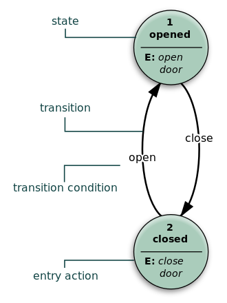

# Error Correction and Detection

(Notes are probably too long for a single class so bring this back on Monday)


## Error Correction Codes                                                     

First add to this error detection codes.  Luhn check.   Luhn is not the best check.
If you are going to use one use Verhoeff - we will talk about that in a moment.
First Luhn.

Every time a CC is verified this is the first step.

Credit cards use from 13 to 16 digits.  You can identify the
system used with

| Leading Digits |  Card type                   |
|:--------------:|:-----------------------------|
|	4            | Visa cards                   |
|	5            | Master cards                 |
|	37           | American Express cards       |
|	6            | Discover cards               |


The first step in validate a card is to use the Luhn algorithm. This is also
called the Mod 10 algorithm. It was developed by Hans Luhn at IBM. This is a
check-digit that is included at the end of the CC number. It is used to validate
a variety of other identification numbers including,  
1. IMEI numbers
2. Greek Social Security Numbers (ΑΜΚΑ)
3. South African ID Numbers,
4. Canadian Social Insurance Numbers,
5. Israel ID Numbers,
6. survey codes appearing on McDonald's, Taco Bell, and Tractor Supply Co. receipts.  
U.S. Patent No.  2,950,048 (now expired) has the details of how it works.

(This is in Homework 3 - so you get to implement this)

Luhn check also known as the Mod 10 check, can be described as follows (as an example let's use 4388576018402626 as our credit card number)
(NOT A VALID CC NUMBER!):

### Steps

1. Double every second digit from right to left. (Why Right to Left?  Think BCD numbers in COBOL).  If doubling of a digit results in a two-digit number, add up the two digits to get a single-digit number (for example: 14:1+4, 15=1+5).
2. Now add all single-digit numbers from Step 1.
```
4 + 4 + 8 + 2 + 3 + 1 + 7 + 8 = 37
```
3. Add all digits in the odd places from right to left in the credit card number.
```
6 + 6 + 0 + 8 + 0 + 7 + 8 + 3 = 38
```
4. Sum the results from (2) and (3) above.
```
37 + 38 = 75
```
5. If the result from Step 4 is divisible by 10, the card number is valid; otherwise, it is invalid.  In a BCD system this just meant to check
that the least significant byte is 0.  This would be the "sign" positive nibble and the "digit" binary 0000.  In our code in "C" for example:
```
	if ( (sum%10) == 0 ) {
```

### Examples

(Consider using the following 2 as test data)

```
		Input : 379354508162306
		Output : 379354508162306 is Valid
```

```
		Input : 4388576018402626
		Output : 4388576018402626 is invalid
```


See: [https://www.geeksforgeeks.org/program-credit-card-number-validation/](https://www.geeksforgeeks.org/program-credit-card-number-validation/)
[https://en.wikipedia.org/wiki/Luhn_algorithm](https://en.wikipedia.org/wiki/Luhn_algorithm)


## State Machines

Why:  
1. Regular expressions.  
2. Capturing state in web applications.
3. Scanners/Parsers
4. Hardware


### Deterministic Finite Automata

My microwave!



### Non-Deterministic 

Can convert automatically to deterministic.  Topic in Compiler Construction.

Example - draw one on the board.

### Regular Expressions

A regular expression is used all over for pattern matching in software.  Virtually every language has
a regular-expression matcher.  Match a US Phone Number

Match a string of characters:

```
	abc
```

Match 0 or more a's

```
	a*
```

Match 1 or more a's

```
	aa*
```

Match 1 or more a's

```
	a+
```

Match Beginning of line with 1 or more a's on it.

```
	^a+
```

Match Beginning of line to end of line with 1 or more a's on it.

```
	^a+$
```

Match a line of contain repeats of `abc`.

```
	^(abc)+$
```

Match letters between a and c with a character class:

```
	[abc]
```

Match 1 or more of letters between a and c with a character class:

```
	[abc]+
```

Match letters between a and z

```
	[a-z]
```

Match Upper and Lower Case a..z A..Z

```
	[a-zA-Z]
```

Match hex digits

```
	[0-9a-fA-F]+
```

Match An Optional 0x or 0X then a hex digit string

```
	(0[xX])?[0-9a-fA-F]+
```

Match a Phone Number

```
	[(][0-9]{3}[)]-[0-9]{3}-[0-9]{4}
```

Most regular expression systems have '\d' for `[0-9]` so

```
	[(]\d{3}[)] \d{3} \d{4}
```

### Hardware

All hardware is a push down acceptor or a Turing machine.

In a digital circuit, an FSM may be built using a programmable logic device, a programmable logic controller, logic
gates and flip flops.   Use use a "register" to store state and a block of "logic" to implement state transitions.


## One Hot Encoding

Encode each value to be a single value.

So if we have "Mike" and "Bob" are names, and we have "Has Dog Y/N" in family.

Raw Data

```
	Mike
	Has Dog: N
```

and

```
	Bob
	Has Dog: Y
```

We can build a 1 hot encoding with 3 columns:

| Mike | Bob | Dog |
|:----:|:---:|:---:|
| 1    | 0   | 0   |
| 0    | 1   | 1   |


## Hamming Distance

Given you have two binary numbers:

```
	0011
	0101
```

The Hamming distance is how many 1's become 0's and how many 0's become 1's.
So in the example:

```
	0011
	0101
 ^ --------
    0110
```
Now count the bits giving us 2.

This is going to be a midterm test question.

It is covered in the book also.

# Combine all of this together (DFA, 1-Hot) etc.


Combine all of this into a single thing.   Dr Mike B. Published this in the past 2 years as a paper.
We will probably be using this for the design of hardware in the IOHK Research lab hear at UW.

Example on board.


# Copyright

Copyright (C) University of Wyoming, 2019-2020.
