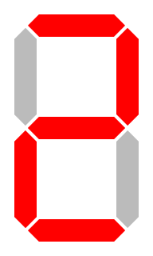
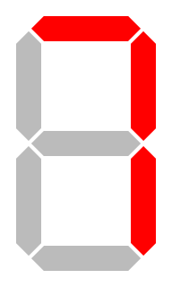
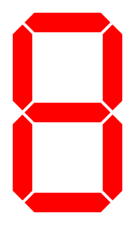

# Homework 3 - Boolean Algebra - Gates / Error Detection

Due Wednesday Mon 24 - by end of class.  You can turn in parts 4,5,6 on paper - 1,2,3 should be uploaded (Upload source code only).

Points total: 200 

Testing you are expected to produce a unit test for each of the following.   The test should print out "PASS" if it is successful
and run at least 4 examples of good and bad values for each.

1. 50pts - Implement a Luhn Verifier.  Implement in your choice of { C, C++, Python, Go, Haskell, F#, Swift, Kotlin }.
2. 35pts - Implement a Verhoeff verifier in { C, C++, Python, Go, Haskell, F#, Swift, Kotlin }.
	(Go steal the code in C - see link - and give credit, note the license - you want an original that is MIT or 3 clause BSD then copy like crazy).
	This is the JavaScript(node.js) and Go version that I have on github.com.    Search google for "verhoeff algorithm".
	[https://github.com/pschlump/verhoeff_algorithm](https://github.com/pschlump/verhoeff_algorithm)
	Java script:  [https://github.com/yuyudhan/verhoeff.git](https://github.com/yuyudhan/verhoeff.git)  Do not copy this - it is proprietary code -  No LICENSE file at all.
	Other solutions: License CC Attribution: [https://en.wikibooks.org/wiki/Algorithm_Implementation/Checksums/Verhoeff_Algorithm](https://en.wikibooks.org/wiki/Algorithm_Implementation/Checksums/Verhoeff_Algorithm)
	Look at the LICENSE - is it OK to use?  What is a BSD 3 calause, an Apache Foundation version 2, a MIT License?  Use GOOGLE!
3. 35pts - write a short C Program to calculate the Hamming distance between 0x43 and 0x121.
4. 25pts - Provide the circuit diagram in mixed logic for

	Dec1 = ( A & !B & !C & !D ) & !X & Y		

	Dec2 = ( A & !B & !C & !D ) & X & !Y

	Dec3 = ( A & !B & !C & !D ) & X & Y

	(A&!B&!C&!D) is a commmon sub-expression in the hardware.
	
5. 25pts - Derive the truth table for:

	

	

6. 30pts - Given the following truth table show the circuit for:
	An examlle of a 7 segment decoder is: 74ls47 7-segment LED decoder  - see [https://buzztech.in/bcd-to-seven-segment-decoder-program-in-vhdl/](https://buzztech.in/bcd-to-seven-segment-decoder-program-in-vhdl/)  Do note that it will not handle 10...15 the same way - it is not decoded to an E.

	I, J, K, L are inputs

	a, b, c, d, e, f, g are outputs

| Decimal Digit    | Hex | I | J | K | L | &nbsp; |   a | b | c | d | e | f | g | Display Pattern                                      |
|-----------------:|----:|:-:|:-:|:-:|:-:|--------|:---:|:-:|:-:|:-:|:-:|:-:|:-:|:----------------------------------------------------:|
| 0                | 0x0 | 0 | 0 | 0 | 0 |        |   1 | 1 | 1 | 1 | 1 | 1 | 0 |                 |
| 1                | 0x1 | 0 | 0 | 0 | 1 |        |   0 | 1 | 1 | 0 | 0 | 0 | 0 |                 |
| 2                | 0x2 | 0 | 0 | 1 | 0 |        |   1 | 1 | 0 | 1 | 1 | 0 | 1 |                 |
| 3                | 0x3 | 0 | 0 | 1 | 1 |        |   1 | 1 | 1 | 1 | 0 | 0 | 1 |                 |
| 4                | 0x4 | 0 | 1 | 0 | 0 |        |   0 | 1 | 1 | 0 | 0 | 1 | 1 |                 |
| 5                | 0x5 | 0 | 1 | 0 | 1 |        |   1 | 0 | 1 | 1 | 0 | 1 | 1 |                 |
| 6                | 0x6 | 0 | 1 | 1 | 0 |        |   1 | 0 | 1 | 1 | 1 | 1 | 1 |                 |
| 7                | 0x7 | 0 | 1 | 1 | 1 |        |   1 | 1 | 1 | 0 | 0 | 0 | 0 |                 |
| 8                | 0x8 | 1 | 0 | 0 | 0 |        |   1 | 1 | 1 | 1 | 1 | 1 | 1 |                 |
| 9                | 0x9 | 1 | 0 | 0 | 1 |        |   1 | 1 | 1 | 1 | 0 | 1 | 1 |                 |
| 10               | 0xA | 1 | 0 | 1 | 0 |        |   1 | 0 | 0 | 1 | 1 | 1 | 1 |                 |
| 11               | 0xB | 1 | 0 | 1 | 1 |        |   1 | 0 | 0 | 1 | 1 | 1 | 1 |                 |
| 12               | 0xC | 1 | 1 | 0 | 0 |        |   1 | 0 | 0 | 1 | 1 | 1 | 1 |                 |
| 13               | 0xD | 1 | 1 | 0 | 1 |        |   1 | 0 | 0 | 1 | 1 | 1 | 1 |                 |
| 14               | 0xE | 1 | 1 | 1 | 0 |        |   1 | 0 | 0 | 1 | 1 | 1 | 1 |                 |
| 15               | 0xF | 1 | 1 | 1 | 1 |        |   1 | 0 | 0 | 1 | 1 | 1 | 1 |                 |

# Copyright

7 Segment Display is modified from Wikimedia Commons CC Attribution license.

Copyright (C) University of Wyoming, 2020.

