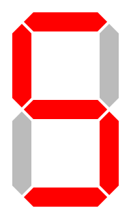

<style>
.pagebreak { page-break-before: always; }
.half { height: 200px; }
</style>

# Lecture 11 

## Homework 3 - Seven Segment Display

The Really Hard way...


```
	c = ( !I & !J & !K & !L ) | 
	    ( !I & !J & !K & L ) | 
		...

```

The Mostly Hard Way...  Reduction using a K-Map


for `c`:
	
 K L Across top

| &nbsp;	 | 0 0 | 0 1 | 1 0 | 1 1 |
|-----------:|:---:|:---:|:---:|:---:|
|	I J 0 0	 |   1 |   1 |  0  |  1  |
|	 	0 1  |   1 |   1 |  1  |  1  |
|	 	1 0  |   1 |   1 |  0  |  1  |
|	 	1 1  |   0 |   0 |  0  |  0  |

<div class="pagebreak"></div>

| Decimal Digit    | Hex | I | J | K | L | &nbsp; |   a | b | c | d | e | f | g | Display Pattern                                      |
|-----------------:|----:|:-:|:-:|:-:|:-:|--------|:---:|:-:|:-:|:-:|:-:|:-:|:-:|:----------------------------------------------------:|
| 0                | 0x0 | 0 | 0 | 0 | 0 |        |   1 | 1 | 1 | 1 | 1 | 1 | 0 |                 |
| 1                | 0x1 | 0 | 0 | 0 | 1 |        |   0 | 1 | 1 | 0 | 0 | 0 | 0 |                 |
| 2                | 0x2 | 0 | 0 | 1 | 0 |        |   1 | 1 | 0 | 1 | 1 | 0 | 1 |                 |
| 3                | 0x3 | 0 | 0 | 1 | 1 |        |   1 | 1 | 1 | 1 | 0 | 0 | 1 |                 |
| 4                | 0x4 | 0 | 1 | 0 | 0 |        |   0 | 1 | 1 | 0 | 0 | 1 | 1 |                 |
| 5                | 0x5 | 0 | 1 | 0 | 1 |        |   1 | 0 | 1 | 1 | 0 | 1 | 1 |                 |
| 6                | 0x6 | 0 | 1 | 1 | 0 |        |   1 | 0 | 1 | 1 | 1 | 1 | 1 |                 |
| 7                | 0x7 | 0 | 1 | 1 | 1 |        |   1 | 1 | 1 | 0 | 0 | 0 | 0 |                 |
| 8                | 0x8 | 1 | 0 | 0 | 0 |        |   1 | 1 | 1 | 1 | 1 | 1 | 1 |                 |
| 9                | 0x9 | 1 | 0 | 0 | 1 |        |   1 | 1 | 1 | 1 | 0 | 1 | 1 |                 |
| 10               | 0xA | 1 | 0 | 1 | 0 |        |   1 | 0 | 0 | 1 | 1 | 1 | 1 |                 |
| 11               | 0xB | 1 | 0 | 1 | 1 |        |   1 | 0 | 0 | 1 | 1 | 1 | 1 |                 |
| 12               | 0xC | 1 | 1 | 0 | 0 |        |   1 | 0 | 0 | 1 | 1 | 1 | 1 |                 |
| 13               | 0xD | 1 | 1 | 0 | 1 |        |   1 | 0 | 0 | 1 | 1 | 1 | 1 |                 |
| 14               | 0xE | 1 | 1 | 1 | 0 |        |   1 | 0 | 0 | 1 | 1 | 1 | 1 |                 |
| 15               | 0xF | 1 | 1 | 1 | 1 |        |   1 | 0 | 0 | 1 | 1 | 1 | 1 |                 |

Final:


The Easy way...

74Ls138 a 3 address, 8 output ROM - pair 2 of them.

Or ATMEL, AT28C64B and not use all of it.  [http://ww1.microchip.com/downloads/en/DeviceDoc/doc0270.pdf](http://ww1.microchip.com/downloads/en/DeviceDoc/doc0270.pdf)


<div class="pagebreak"></div>

## More on Instructions

xxx is the 12 bits of 'hand'.

| Op      | Hex Code   | Implemented by       |
|----------:|---------:|:---------------------|
| JnS       | 0x0xxx   | mdr = pc             |
|           |          | mar = hand           |
|           |          | mem[mar] = mdr       |
|           |          | ac = hand            |
|           |          | ac = ac + 1          |
|           |          | pc = ac              |
| Load      | 0x1xxx   | mar = hand           |
|           |          | mdr = mem[mar]       |
|           |          | ac = mdr             |
| Store     | 0x2xxx   | mar = hand	          |
|           |          | mdr = ac             |
|           |          | mem[mar] = mdr       |
| Add       | 0x3xxx   | mar = hand           |
|           |          | mdr = mem[mar]       |
|           |          | ac = ac + mdr        |
| Subt      | 0x4xxx   | mar = hand           |
|           |          | mdr = mem[mar]       |
|           |          | ac = ac - mdr        |
| Input     | 0x5000   | Input Reg ⟸  ⟸       |
| Output    | 0x6000   | Output Reg ⟹         |
| Halt      | 0x7000   | Do Nothing           |

<div class="pagebreak"></div>

| Op      | Hex Code   | Implemented by       |
|----------:|---------:|:---------------------|
| Skipcond  | 0x8y00   | see below            |
| &nbsp;Lt0 | y == 0x0 | if ac >= 0, pc += 1  |
| &nbsp;Eq0 | y == 0x4 | if ac == 0, pc += 1  |
| &nbsp;Gt0 | y == 0x8 | if ac <= 0, pc += 1  |
| Jump      | 0x9xxx   | pc = hand            |
| Clear     | 0xA000   | ac = 0               |
| AddI      | 0xBxxx   | mar = hand           |
|           |          | mdr = mem[mar]       |
|           |          | mar = mdr            |
|           |          | mdr = mem[mar]       |
|           |          | ac = ac + mdr        |
| JumpI     | 0xCxxx   | mar = hand           |
|           |          | mdr = mem[mar]       |
|           |          | pc = mdr             |
| LoadI     | 0xDxxx   | mar = hand           |
|           |          | mdr = mem[mar]       |
|           |          | mar = mdr            |
|           |          | mdr = mem[mar]       |
|           |          | ac = mdr             |
| StoreI    | 0xExxx   | mar = hand           |
|           |          | mdr = mem[mar]       |
|           |          | mar = mdr            |
|           |          | mdr = ac             |
|           |          | mem[mar] = mdr       |

## References:

The 7 seg is from [https://quickgrid.wordpress.com/2015/03/22/7-segment-decoder-implementation-truth-table-logisim-diagram/](https://quickgrid.wordpress.com/2015/03/22/7-segment-decoder-implementation-truth-table-logisim-diagram/)

