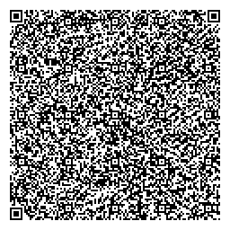

# Lecture 15 - Memory

## News

1. ARM 80 Core Systems

## Return Test

## Memory

Chapter 6 in the book.

Cost v.s. Speed.

This is the "most" common mis-spoken thing about computers.  

1. Registers
2. Register Files (Motorola 68000, all modern microcode systems)
3. L1 Cache (256K to 1M)
4. L2 Cache (2Mb to 8Mb per core)
5. L3 Cache (shared across processors) 2Mb * Number of Cores - Shared across Cores
5. GFX Cache - Graphics Cache
6. Main Memory - DRAM ( John B. Goodenough - total is 70 Billion KWH of electricity, 1/5 of worlds electricity )
7. SSD - 3d SSD - Processors berried in our storage systems
8. Rotating Disk - In many flavors
9. Removable Disk
10. Tape Backup - Tape Storage
11. Distributed (J-Token) - IPFS - Across Network Storage
12. Remote Across Network (AWS S3/Dropbox)
13. Remote Cheep (AWS Glacier) (Actually to Tape)
14. DNA as Storage - as of 2019 all 16Gb of wikipedia have been encoded into a DNA storage and retrieved.
15. Glass Disks - See Image - No Erase - lasts 25000 years or more.
16. High Reliability / Offline - Example of a QR Code.

Specter Attack - Side Channel Attacks.

Overview of Windows / Memory - Virtual Memory.    The "working set".

Overview of Unix / Linux - Virtual Memory.  Server friendly uniform virtual memory.

Non-VM systems.  VX-OS.  SymbianOS.  Most IOT devices.  RTOS (Version of Linux)

## Example test question for Next Midterm

1. Explain what the L1, L2 and L3 caches are in an x86/AMD-64 Processor.
2. Explain what NUMA is.
3. What are the good and bad properties of using a QR code for storage.

# Copyright

Copyright (C) University of Wyoming, 2020.

