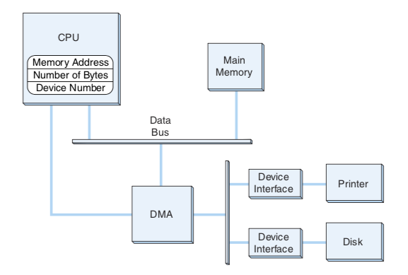
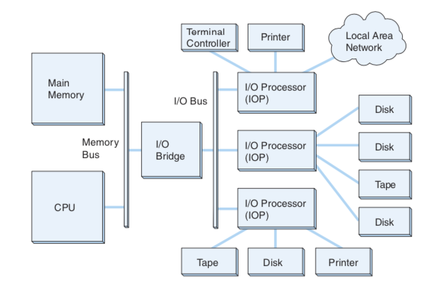
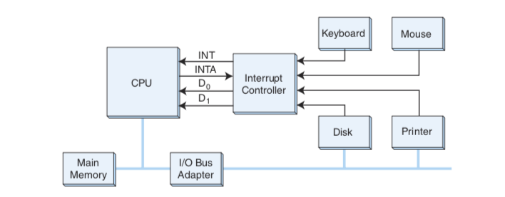

# Lecture 18 - IO and other fancy stuff

## A bit of news

## The other bit of news

I would assume that we will be moving to an online / zoom based class.

1. Install zoom on your system.
2. Use the following link:
[https://uwyo.zoom.us/j/5976304542](https://uwyo.zoom.us/j/5976304542)
Unless I send out a new better link.


Read chapter 6.  Casually read chapter 6 - not study in detail.

You will get a copy of the exact test questions on "Memory" before the next
test - so no mysteries - it will be questions that are useful about Virtual
Memory and performance.

So...

## Testing - Hardware - how it is done 

And some lesions for how to test software.

Smaller and Smaller test area.

## JnS / JumpI instruction - how they work

Example:

```
/ Call subroutine PrintA
    JnS PrintA
    Halt

/ The Subroutine
PrintA, HEX 000 / This address will hold return
    Load An_A
    Output

    / Return from Subroutine
    JumpI PrintA

An_A, DEC 97
```

In Hex:

```
0002        # 0000
7000        # 0001
0000        # 0002
1006        # 0003
6000        # 0004
c002        # 0005
0061        # 0006
```

## Input / Output

How Input/Output Works:

1. Polling - or Programmed I/O
2. Interrupt Driven I/O
3. DMA - Direct Memory Access
4. Channel IO - multiple communication channels

Example of "real time" processing at different levels.

A mouse or touchpad is a nice real time device.  Response needs to be 10ms or faster.

Bad real time - we have a electronic white board that has 1/4 to 1/2 second delay between
marking with your finger and the line appearing.

An Apple iPad Pro and pencil - very very real time. -- 9ms latency -


DMA - direct memory access.



Most common DMA access these days is network access.



IA64 architecture - based on the 1980s 8080 chip, an 8bit version of the Intel 4004 chip has
15 interrupt lines for everything.  So... multiple devices share an interrupt line.  This
requires the OS to sort out when multiple devices ask for attention at the same time.

ARM allows for multiple interrupt vector tables with a table at address 0x0 on reset.
Each table can have up to 128 custom user interrupts + 22 or 24 predefined interrupts
depending on the ARM chip.   Testing of serves tends to indicate that the interrupt 
capability adds about 3-6% to the overall performance in a high-IO environment.
This is the most common approach in processor design as it uses less logic to
detect that an interrupt is active.  This is also the easier for humans to understand
model.



Intel IA64 uses an in-instruction interrupt - that cancels the current instruction.
ARM uses a "in-fetch" cycle that stops the running of the fetch of the next 
instruction and appears to the user as "after the current instruction" 
timing.


## Note:

Diagrams are taken from our textbook, 3rd edition.
The Essentials of Computer Organization and Architecture, 5th edition, Linda Null & Julia Lobur.


# Copyright

Copyright (C) University of Wyoming, 2020.


