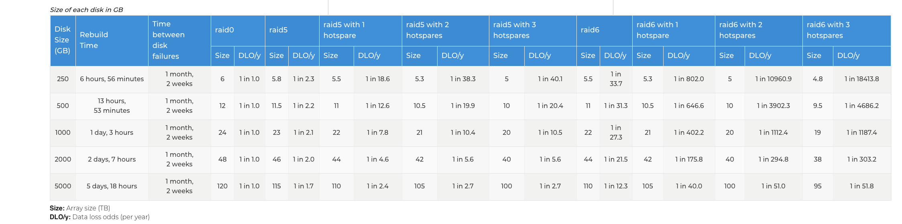

# Lecture 19

My best guess is that this may be our last in-person lecture for a long time.
1. Spring break is extended till the 29th (an extra week).   This means that you
have till the 30th of the month for Homework-4 (due today) to be only 1 day late.
2. The teaching staff (that means me) is to take the extra week to setup for
remote instruction for all classes.
3. Most important - take good care of yourself!

Our first "zoom" based office hours worked!  It worked really well!

## RAID - Redundant Array Inexpensive Disks

RAID arrays have just become the "thing" - manager's and business types just
plan on it as a way of protecting data.  People just think that this is the
way to make your data safe - and the spend on it.

What RAID is not!

Why RAID?  I want to protect my data.

First - what is the history of RAID.
RAID started out on disks that were 1MB to 5MB - and they were much cheaper than corresponding high reliability 25 or 50MB disks.
A 5MB SCSI interface disk would cost $1750 - and you could build a RAID array with 10 of them.   A 35MB disk from IBM or DED would
cost $250,000.00 and give you the same reliability - but with much lower performance.

### What makes it work.
Raid5 uses checksums and error correction.  So when you read it checks to see if an error happened.   If an error then it rebuilds 
the block using the error correction and starts a re-build of the disk onto a "hot spear" or a "cold spear".   This means that
to recover you have to do a "rebuild" operation.

Raid0 uses a duplicate of the data - so you don't have to do math - but it costs twice as much to store the data.  Rebuild
operation still take a write of a disk.

Disks have gotten bigger and bigger - and people still think that raid worked the way it has always worked.  Also peoples
exception of acceptable down time has gotten less and less.  They are really put out when a system is offline for 5 minutes,
let alone days.

### Data rot happens

Data will degrade over time.

Single point of failure happens.  A single RAID controller with a set of disks - then the controller is the single point of 
failure.

### So how effective is RAID today?

Raid Recovery Times:

DLO/y = Data Loss Odds per Year

## Alternatives to RAID

BTRFS: a better file system.

Fully Distributed data.  Google's F1 database.

