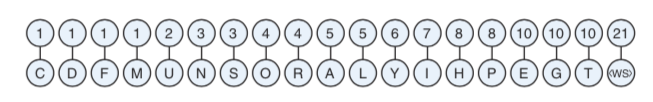
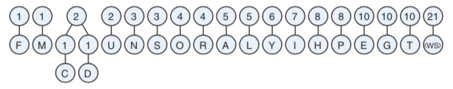
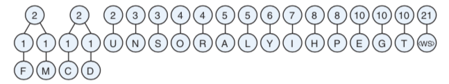

# Lecture 20 - Fetch Cycle in Microcode

# LZ Compression 

Please read the section in chapter 7 on LZ compression.

The basic idea behind LZ an d LZW compression is to take advantage of repetition in files and replace repeated sections with a "code" that
represents the repeated section.   This can be beneficial in both time and space.  Some kinds of documents like XML and JSON documents
that are used for data exchange have a large amount of repeated information in them.  By replacing the repeated section with a single code
it can make the transmission of the document both faster and take up less CPU time.  

Let's take a sample of text:

```
Theophilus Thistle, the unsuccessful Thistle sifter,
In sifting a sleeve full of un-sifted Thistles,
Thrust three thousand Thistles through the thick of his thumb.
```

If we replace `Thistle` with a code `1` and put a dictionary saying this is our replacement at the beginning we end up with:

```
1=Thistle
Theophilus 1, the unsuccessful 1 sifter,
In sifting a sleeve full of un-sifted 1s,
Thrust three thousand 1s through the thick of his thumb.
```

LZ compression implements this in an orderly fusion by starting out with a dictionary of letters and growing each entry in
the dictionary as it analyzes the document.  Normally the dictionary is 4096 bits using the first 26 for letters and
encoding all of the document into 12 bit codes that are in the dictionary.  4096 is 2 to the 12th power so 0b1000_0000_0000 
or 0x800.

Since the dictionary has to be first to decode the document for small documents this will result in a bigger output.
In documents being sent across the web Google has analyzed that any document less than 1721 bytes is better off
left un-compressed.

Let's walk through the example in the book.

First the data is analyzed for the frequency of letters.  The reason for this is we will encode the least common
letters as the longest patterns.  In a real compression system instead of letters this will be the least common
strings - but in our example we will just use letters.  For the following text:

```
HIGGLETY PIGGLETY POP
THE DOG HAS EATEN THE MOP
THE PIGS IN A HURRY THE CATS IN A FLURRY 
HIGGLETY PIGGLETY POP
```

This gives us:



`<ws>` is the blank (whitespace) in our example.  There are 21 blanks in the text.  There is only 1 'T'.

The rest of this process is how to group these frequencies into a tree so that traversing the tree in 
the correct order will result in the letter we want to have.

Starting on the left with the least frequent letter.  (this will result in the depth of the tree being
the deepest for the least used letter in the document)

Group 2 low frequency items together and build a sub-tree.



We have a tie for the 1 frequency items so just pick the left most 2 of them "C" and "D" - add the 
frequency together 1+1 is 2 - so insert this back into our list as a 2 frequency with a little tree
of C and D.   Repeat for "F" and "M".

This give us:




