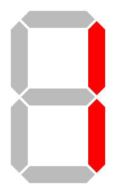

# Lecture 25 - System Software

## Videos

[https://youtu.be/SOgFnj-yXdA - Lect-25-cli-pt1.mp4](https://youtu.be/SOgFnj-yXdA)<br>
[https://youtu.be/jw5hanTW1W0 - Lect-25-cli-pt2.mp4](https://youtu.be/jw5hanTW1W0)<br>
[https://youtu.be/X1qYt-xFhzg - Lect-25-cli-pt3.mp4](https://youtu.be/X1qYt-xFhzg)<br>
[https://youtu.be/Zj5n6uguqTA - Lect-25-cli-pt4.mp4](https://youtu.be/Zj5n6uguqTA)<br>
[https://youtu.be/Pplu3ZJM6PI - Lect-25-pt5-cli.mp4](https://youtu.be/Pplu3ZJM6PI)<br>

From Amazon S3 - for download (same as youtube videos)

[http://uw-s20-2015.s3.amazonaws.com/Lect-25-cli-pt1.mp4](http://uw-s20-2015.s3.amazonaws.com/Lect-25-cli-pt1.mp4)<br>
[http://uw-s20-2015.s3.amazonaws.com/Lect-25-cli-pt2.mp4](http://uw-s20-2015.s3.amazonaws.com/Lect-25-cli-pt2.mp4)<br>
[http://uw-s20-2015.s3.amazonaws.com/Lect-25-cli-pt3.mp4](http://uw-s20-2015.s3.amazonaws.com/Lect-25-cli-pt3.mp4)<br>
[http://uw-s20-2015.s3.amazonaws.com/Lect-25-cli-pt4.mp4](http://uw-s20-2015.s3.amazonaws.com/Lect-25-cli-pt4.mp4)<br>
[http://uw-s20-2015.s3.amazonaws.com/Lect-25-pt5-cli.mp4](http://uw-s20-2015.s3.amazonaws.com/Lect-25-pt5-cli.mp4)<br>

## Software and the Integrated Development Environment (IDE)

There are lots of "IDE"s - like Eclipse for Java and PyCharm for Python.

Please read the linked web page on IDEs. 

If all we did was develop desktop GUI applications IDEs would sort of make sense.
Reality is that most software today is:

1. Distributed over the web (web front end / server back end connecting to a database)
2. Running on servers (in remote data centers like AWS/EC2)
3. Running on embedded devices (iOS/Apple, Android, IoT, Controllers, Blockchain)

## What is the alternative to the "finder"

The command line.

What is good about the command line?  Isn't it ancient - yes it is.

1. It is repeatable.  - Example WIX.
2. It is a "language" - what this means - DFA/NDFA v.s. Push Down Automata.
3. It is testable - that means it is reliable.
4. It works remotely.
5. It has software re usability.
6. It is documentable.
7. It is everywhere.


## Tools - How to make better use of the tools that are available.

Computers are awesome at making stuff easier for you to use.  I have 
pointed out limitations in GUI tools.  What is the alternative.   A GUI is
by and large limited to being a deterministic-automata.  Think DFA or NDFA.
What happens if we move to a Push Down Automata - a Language?

The GUI shell - it's easy - if you just want to edit a document or work on
a spreadsheet or spend your day drawing an image in Photoshop.  Awesome.  
As a developer you do lots of stuff.   GUI's are awesome so long as the tool
has a button to do what you want.  Software development is about doing more,
better, faster.

A language based shell.   Bash is an example of a language based shell.
Mac's today use zsh - it is a super set of Bash.  You can use Bash on
Windows - install git with the MinGW system or use the Windows Linux Subsystem.
Both have Bash.   Bash - the Bourn again shell - implemented by Michael Bourn
was built to be a super sheet of the "sh" shell - originally implemented in  1966 to
1969 for the Unix Operating System.  Bash is 20 years newer and much more modern!
The thermostat on the wall running Linux (RTOS) has "busy-box" and it runs "sh".

One of the first things that I always look for in a new language is how to 
print something out in the language that I am using.

In Bash you can do this!

When you see `$ ` in some documentation usually you are being directed to run
something at the shell proms.  If you see `# ` this means a special privileged
account in the shell - we will get back to this.

So...

```
$ echo A b C
A b C
```

That is exciting!  How about that - we can print!
What about printing some blanks - to do that we have to quote the string.

```
$ echo "A    B      C"
A    B      C
$ echo 'A  B'
A  B
```

A question is what is "echo"?  Echo can be a program that is not part of "BASH"
it is a program.  This is just like running Photoshop.

You can also find out what the date is.

```
$ date
Tue Apr 14 20:37:08 MDT 2020
```

Shows the date.

Or you can get an entire calendar.

```
$ cal
     April 2020       
Su Mo Tu We Th Fr Sa  
          1  2  3  4  
 5  6  7  8  9 10 11  
12 13 14 15 16 17 18  
19 20 21 22 23 24 25  
26 27 28 29 30        
```               

You can also pass options to commands.  If you want the calendar for
the year 2020 - "a year to remember" then.

```
$ cal 2020

                            2020
      January               February               March          
Su Mo Tu We Th Fr Sa  Su Mo Tu We Th Fr Sa  Su Mo Tu We Th Fr Sa  
          1  2  3  4                     1   1  2  3  4  5  6  7  
 5  6  7  8  9 10 11   2  3  4  5  6  7  8   8  9 10 11 12 13 14  
12 13 14 15 16 17 18   9 10 11 12 13 14 15  15 16 17 18 19 20 21  
...
...
...
                                                                  
```

Interestingly try 1752 - look at september!

```
$ cal 1752
                            1752
      January               February               March          
Su Mo Tu We Th Fr Sa  Su Mo Tu We Th Fr Sa  Su Mo Tu We Th Fr Sa  
...
...
...

        July                 August              September        
Su Mo Tu We Th Fr Sa  Su Mo Tu We Th Fr Sa  Su Mo Tu We Th Fr Sa  
          1  2  3  4                     1         1  2 14 15 16  
 5  6  7  8  9 10 11   2  3  4  5  6  7  8  17 18 19 20 21 22 23  
12 13 14 15 16 17 18   9 10 11 12 13 14 15  24 25 26 27 28 29 30  
19 20 21 22 23 24 25  16 17 18 19 20 21 22                        
26 27 28 29 30 31     23 24 25 26 27 28 29                        
                      30 31                                       
...
...
...
```

`cal` has the right thing - you can go digging through history 
but September 1752 is the shortest month of the year!

Often options are specified with a single character preceded
by a `-` (minus) sign.  For example you can list the contents
of a file with `cat`.

Let's say I have a file with `abc` 3 times in it.

```
$ cat abc.txt
abc
abc
abc
```
or if I want line numbers

```
$ cat -n abc.txt
     1	abc
     2	abc
     3	abc
```

Non abbreviated options usually have 2 minus sines.

For example there is a command called "grep" and we can look at the
man page for it.  (Note it is often "q" to exit man pages).

```
$ man grep
```

and see that there is a "--exclude" option.


Now where do all these commands come form?

These are found using a special variable called PATH.  This is true
on both Unix/Linux/Mac and on Windows.  These variables area called
"environment" variables.

You can print out an environment variable with a "$" in front - this works
in the Unix/Linux/Mac world.  In the PwerShell (windows) you want $env:PATH.

```
$ echo $PATH
...
```

You can set variables - but what is the meaning of the PATH.

The path is separated into directory chins with ";" or ":" depending on the
shell in use.

```
$ echo $PATH
.:/Users/pschlump/bin:/Users/pschlump/go/bin:/usr/local/go/bin:/opt/local/bin:/usr/bin:/bin:/usr/sbin:/sbin:/opt/X11/bin:
```

This is my "PATH" - each one is separated by ":" character.

Let's take a look at what the directories are.  The Path is searched form the beginning to the end.

| Path                    | Meaning                                         |
|-------------------------|-------------------------------------------------|
| .                       |  The current directory.                         |
| /Users/pschlump/bin     |  My home directory ./bin                        |
| /Users/pschlump/go/bin  |  My "go" pgroams                                |
| /usr/local/go/bin       |  System wide shared - but local to my system    |
| /opt/local/bin          |   System wide shared - but local to my system   |
| /usr/bin                | System wide binaries                            |
| /bin                    | System wide binaries                            |
| /usr/sbin               | System wide binaries                            |
| /sbin                   | System wide binaries                            |
| /opt/X11/bin            | System X11 Graphics wide binaries               |


The fact that I have "." in my path means that any file that is the current directory
will override a system command by the same name!  Also my HOME/bin has the same
purpose but for all of my commands.

So if I created a program called "cat" that did some other task - then wen I entered the
`cat` command it would replace the system "cat" with the new program.  Let's try it.

I will write a tiny C program that prints out the word "Bark" when it gets run.

The code is:

```
#include <stdio.h>

int main ( int argc, char * argv [] ) {
	printf ( "Bark\n" );
}

```

Now I compile it:

```
$ cc -o cat cat.c
```

Now I run it.

```
$ cat abc.txt
Bark
```

I can still get to the original "cat" but I have to use the full path to the program.
This is an "absolute" path.

```
$ /bin/cat abc.txt
abc
abc
abc
```

The rule to take away from this is that the PATH is searched for "cat" until it is
found - in order.  The first one found is run.  So a "cat" in the "." Directory will be
found before the one in "/bin".  The PATH is order dependent!

You can change the PATH!

```
$ PATH="/Users/pschlump/bin:/Users/pschlump/go/bin:/usr/local/go/bin:/opt/local/bin:/usr/bin:/bin:/usr/sbin:/sbin:/opt/X11/bin:"
```

I have now removed "." from the path and I will get the system "cat" instead.

```
$ cat abc.txt
abc
abc
abc
```

On windows the "PATH" is not per-shell - it is system wide.  So if you change your "PATH" it applies to
all programs on the system.   There is a dialog-GUI box to do this.  I always have to use google 5 or 6 times
to find the box and it is really hard to change.    Try using the "bash" shell on Windows (MinGW) and is
much easier to live with.

This PATH stuff applies to both GUI shells and the bash/sh/zsh type shells.  So if you have a program installed
on your system and your shell can't find it - it is probably because of the "PATH".   A good example is you
install "Python" 3.8.4  and then try to run it and -- oops it runs python 2.7?  Why?  -- Look at the PATH.
You have an version of 2.7 in the PATH before the new version.

File "extensions" - a file extension is just whatever characters are after the last "." in the file name.
GUI's like to associate this with a program.  I think that is quite "silly" .  For example I used the
extension ".txt" earlier.   I can change the file to be any extension that I want.

To rename a file at the command line you use the "mv" command.

```
$ mv abc.txt abc.MyMom
$ cat abc.MyMom
abc
abc
abc
```

Will show the same thing.  A text file is any file that has ASCII 32 to 127 characters in it in lines.
So your .m2 file with microcode in it is a "text" file.  You can edit text files with a text editor.
For example on Windows Notepad++ or VI.   We are going to use a more modern version of VI called VIM
for Vi Improved.  Notepad++ is common on Windows systems.   In my opinion it is a "week" editor.  When
we work with Vi you will see why.  Professional software developers primarily use 3 editors. 

| Editor |  Usage |
|--------|--------|
| VI/VIM | 37% |
| Emacs | 24% |
| Atom | 18% |

Also note that VI users get payed on average 14% more.  Why?

`mv` has other uses.   It takes 2 file paths.  The from path and the to path.
In our example the from was `abc.txt` in the current directory and the to path
was `abc.MyMom`.    You can specify a full path for the file.  There is a directory on Unix/Linux/Mac
systems called /tmp - lets move our file to that directory (note that this directory will get cleared
out when you re-boot your system).

```
$ mv abc.MyMom /tmp/bob
```

You will notice that I started the path with "/" - that tells the move command to start at the top of
the file system.   This is an "absolute" path.   I can also specify paths with relative paths.
For example I can move a file to the directory above my current one.

```
$ mv cat ..
```

".." means the directory that is a parent of this directory.  Remember that we created a program
called "cat" earlier.  It has now been moved up one directory.

You can both move and rename a file at the same time.

```
$ mv /tmp/abc.MyMom ./abc
```

In this case I have renamed the file to just "abc" - no file extension at all.
The file is still a "text" file.  It did not quit being a text file by removing the
extension.

Most interestingly you can rename files to be things that will cause Windows uses
to have fits.

```
$ mv abc abc.exe
$ cat abc.exe
abc
abc
abc
```

So what is a "relative" path and an "absolute" path?

You are at a location in the file system.  You can find this out with the "pwd" command.
This "prints the working directory".

```
$ pwd
/Users/pschlump/go/src/github.com/Univ-Wyo-Education/S20-2150/Lectures/Lect-25
```

Paths that are "absolute" start with "/".  The "/" is the file separator.  On windows
it is a "back-slash".   That is the "\\" character.   Backslashes have the top leaning
to the left.  Slash is the same as the "division" operator.

So my path starts out at the "top" with "/Users".  On most Linux systems it will start
out with "/home".  On Windows it usually starts with "C:\\".
If you use the MinGW bash shell on windows you get "/c/" as the top of the system.
One of the innovations of Unix in the late 1960s and early 1970s was to replace
"special device" names with just paths in the file system.  This made it much
easier for all commands to deal with these devices in a uniform way.  Another file
that you can create on a Unix/Linux system that will annoy Windows users is the
file "nul".  There is a Unix/Linux tool "cp" to copy a file.  It is "cp from to"
so...


```
cp abc.exe nul
```

That won't work on Widows.  It is also very interesting to send file attachments
to windows users with a file called "nul".   This usually involves some very
frustrated laughs.


## File Extensions

Just using the "extension" on a file to determine the file type falls down a lot.
For example.  Let's say that I have a Structured Vector Graphics file - an image
specified in a text format.  I would like to edit it with my text editor to change
it.

For example the 7 segment display with file.  7-seg-1.svg.  Let's cat it.

```
$ cat 7-seg-1.svg
<?xml version="1.0" encoding="UTF-8" standalone="no"?>
<!DOCTYPE svg PUBLIC "-//W3C//DTD SVG 1.1//EN" "http://www.w3.org/Graphics/SVG/1.1/DTD/svg11.dtd">
<svg xmlns="http://www.w3.org/2000/svg" width="192px" height="320px" viewBox="-1 -1 12 20">
<g id="abcdefg" style="fill-rule:evenodd; stroke:#FFFFFF; stroke-width:0.25; stroke-opacity:1; stroke-linecap:butt; stroke-linejoin:miter;">
  <polygon id="a" points=" 1, 1  2, 0  8, 0  9, 1  8, 2  2, 2" fill="#bbbbbb"/>
  <polygon id="b" points=" 9, 1 10, 2 10, 8  9, 9  8, 8  8, 2" fill="#ff0000"/>
  <polygon id="c" points=" 9, 9 10,10 10,16  9,17  8,16  8,10" fill="#ff0000"/>
  <polygon id="d" points=" 9,17  8,18  2,18  1,17  2,16  8,16" fill="#bbbbbb"/>
  <polygon id="e" points=" 1,17  0,16  0,10  1, 9  2,10  2,16" fill="#bbbbbb"/>
  <polygon id="f" points=" 1, 9  0, 8  0, 2  1, 1  2, 2  2, 8" fill="#bbbbbb"/>
  <polygon id="g" points=" 1, 9  2, 8  8, 8  9, 9  8,10  2,10" fill="#bbbbbb"/>
</g>
</svg>
```

So SVG is a text format.
We can edit it with a text editor.  In fact the 1st line in it indicates that it is an XML file.
XML is a text format!

But it is also an "image"  We can convert it to a .png - a binary image format.  You probably don't
have it installed on your system but there is a command that reads SVG and outputs .png.

```
/usr/local/bin/rsvg-convert 7-seg-1.svg > 7-seg-1.png
```

Then you can look at it as an image.



You browser can also display it as an image.  The Graphics for "http://www.2c-why.com/" are all done in SVG.

What happens when you "double" click on it?  On a default mac it comes up in the browser.  On my system it
shows up in Visual Studio Code as an image.  What fails to happen is it showing up in an editor for text
to edit it.

This is a incomplete list of programs that could be associated with ".svg" on my system - I use all of them!

| Program | Description |
|----------|------------|
| Google Chrome  | browser |
| FiireFox  | browser |
| Adobe Photoshop | image editor |
| Adobe ilustrator | image editor |
| gimp | image editor |
| opera | browser |
| MacVim | editor |
| Vim | editor |
| Atom | editor |
| Microsoft Visual  Studio | editor / IDE |
| AutoDesk sketchbook | image editor |
| hugin | image processing tool |
| Preview | image display tool |
| Safiri | browser |
| screenflow | screen capture tool |
| textedit | text editor |
| XCode | Apple development IDE |
| PyCharm | Python IDE |
| xml-explore | XML data editor |
 
These are just the programs that are GUI based - not all the command line tools that I use to process
images!

So which one should be "associated" with .svg?     On any given day I might use 5 to 10 of these!


# Copyright

Copyright (C) University of Wyoming, 2020.

