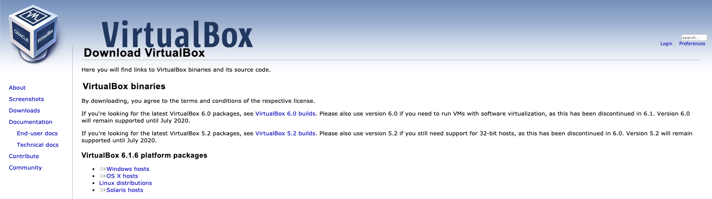
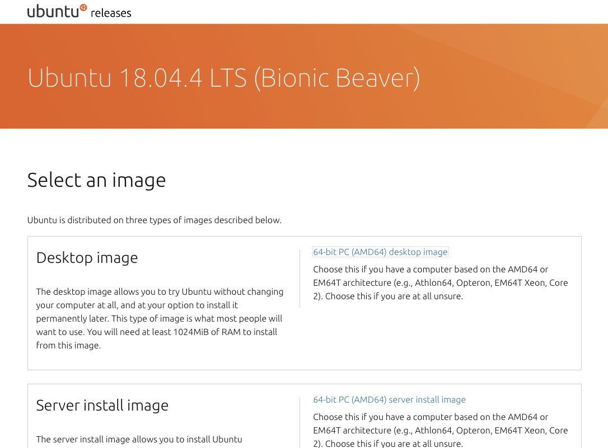
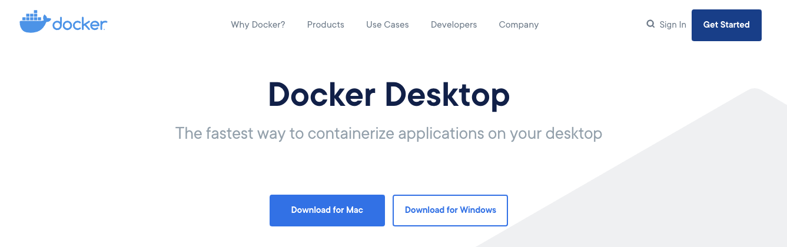

# Homework 7 - Virtualisation - 2 parts

# Part 1 - Install a virtual Linux machine

25pts
Due - May 1

Install a copy of Oracle VitrualBox on your system.  Then download
Ubuntu 18.04 Desktop and install a virtual server.  We will use the
virtual server for Wens day's lecture on process management in Unix/Linux
type systems.

Virtual Box Download: [https://www.virtualbox.org/wiki/Downloads](https://www.virtualbox.org/wiki/Downloads)

Looks like: 

Ubuntu Download: [https://releases.ubuntu.com/18.04.4/](https://releases.ubuntu.com/18.04.4/)

Looks like: 

Turn in a screen capture of your Ubuntu system running on your desktop.

Login to your "system" and poke around!

# Part 2 - Install Docker - setup a Docker container

25pts
Due - May 1

Docker Download: [https://www.docker.com/products/docker-desktop](https://www.docker.com/products/docker-desktop)

Looks Like: 

Docker File - attached 

Python Program -  attached 

Run the sample python program in your docker container - and turn in
the output from the sample program.

Once you have docker installed:

Mac or Linux (in some directory where you have your Dockerfile):

```
$ docker pull python
$ docker xyzzy
$ docker 
```

Windows

```
C:\> mkdir my-docker
C:\> cd my-docker
C:\> copy C:\Downloads\Dockerfile .
C:\my-docker\> docker pull python
C:\my-docker\> docker xyzzy
C:\my-docker\> docker xyzzy
# echo "You are at the shell in the container"
```
